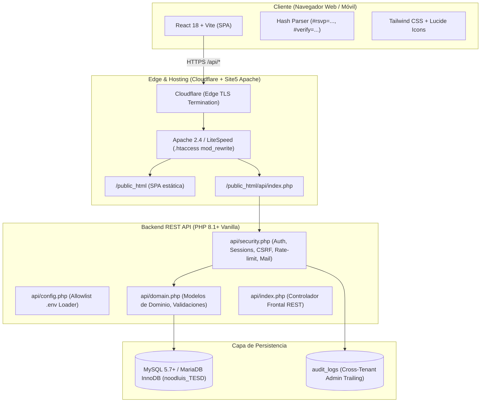

# Arquitectura del Sistema — Tu Evento sin Dramas

> **Sistema:** Tu Evento sin Dramas (Gestor Multi-usuario de Eventos, Roster Privado y RSVP)  
> **Compañía / Slug:** `tueventosindramas` (Alias: `tesd`)  
> **Organización:** Dataholics  
> **Entorno de Producción:** `https://tueventosindramas.dataholics.com.mx/`  
> **Repositorio Oficial:** `https://github.com/DEV-Dataholics/TEsD` (Branch: `main`)  
> **Base de Datos:** MySQL `noodluis_TESD` en Site5 (`shared63.accountservergroup.com`)  
> **FTP User:** `dev_TESD@tueventosindramas.dataholics.com.mx`  

---

## 1. Visión y Propósito del Sistema

**Tu Evento sin Dramas** es una aplicación multi-usuario orientada a organizadores de eventos (bodas, fiestas, reuniones corporativas y familiares) diseñada para eliminar la fricción operativa de la gestión de invitados y confirmación de asistencia.

Sus pilares fundamentales son:
1. **Roster Reutilizable de Personas:** Agenda privada por organizador independiente de cualquier evento, con clasificación de adultos/niños, restricciones dietéticas (alergias, celiaquía, preferencias) y notas de comportamiento.
2. **Invitaciones y RSVP Seguro:** Enlaces únicos de confirmación individual que viajan en el fragmento de URL (`#rsvp=...`) sin exponer tokens a servidores intermediarios o registros de logs.
3. **Semaforización Automática de Complejidad:** Algoritmo determinista en interfaz para destacar invitados con requerimientos alimentarios o logísticos complejos (🟢 Verde: sin notas, 🟡 Amarillo: 1 requerimiento, 🔴 Rojo: múltiples notas/alergias).
4. **Captura Inteligente por Foto (OCR):** Ingesta asistida por IA (OpenAI Responses API) para convertir listas manuscritas en registros de invitados estructurados.
5. **Aislamiento Estricto Multi-Inquilino (Multi-Tenant Isolation):** Cada organizador solo tiene visibilidad y control sobre sus propios eventos y contactos.

---

## 2. Principios Rectores y Seguridad

* **Aislamiento por Propietario (`owner_user_id` / `user_id`):** Ninguna consulta SQL sobre eventos, contactos o invitaciones se resuelve con IDs crudos proporcionados por el cliente. Siempre se valida la pertenencia contra la sesión autenticada.
* **Tokens Seguros en Fragmentos de Hash:** Los tokens de verificación de cuenta (`#verify=...`), recuperación de contraseña (`#reset=...`) y confirmación de asistencia (`#rsvp=...`) se sitúan exclusivamente en el fragmento `#` de la URL. Los navegadores jamás envían fragmentos en encabezados HTTP o URLs de petición, previniendo fugas en logs de proxies o `Referer`.
* **Tokens Almacenados como Hash:** En la base de datos solo se persisten digests SHA-256 (`token_hash`, `csrf_token_hash`), nunca tokens en texto plano.
* **Sesiones HttpOnly y CSRF:** Cookies de sesión marcadas como `HttpOnly` y `SameSite=Lax`. Toda mutación (`POST`, `PATCH`, `DELETE`) exige validación estricta de token anti-CSRF y coincidencia de origen (`Origin` header matching `APP_BASE_URL` o `APP_ALLOWED_ORIGINS`).
* **Cero Secretos en el Document Root:** Las credenciales (`database.env`, `application.env`) residen fuera del directorio `public_html` (`/home/CPANEL_USER/credentials/`).

---

## 3. Stack Tecnológico



---

## 4. Estructura de Directorios del Repositorio

```
TEsD/
├── api/
│   ├── .env.example          # Plantilla de variables de entorno
│   ├── .htaccess             # Bloqueo de acceso HTTP directo a scripts internos
│   ├── config.php            # Carga segura de variables (DB_*, APP_*, OPENAI_*)
│   ├── domain.php            # Reglas de negocio, consultas SQL parametrizadas, OCR
│   ├── index.php             # Enrutador principal de endpoints REST y respuestas JSON
│   ├── router.php            # Router para servidor de desarrollo PHP (php -S)
│   └── security.php          # Criptografía, sesiones, cookies, CSRF, mailer, rate limit
├── credentials/              # Secretos locales (ignorado por Git, no subir a public_html)
│   ├── application.env
│   └── database.env
├── database/
│   └── schema.sql            # DDL canónico de todas las tablas e índices
├── docs/                     # Documentación oficial del proyecto
│   ├── despliegue-site5.md   # Manual de despliegue y notas de hosting
│   ├── guia-tecnica.md       # Guía de arquitectura y endpoints
│   ├── manual-administrador.md # Manual del operador y superusuario
│   ├── manual-invitado.md    # Flujo de confirmación RSVP para invitados
│   ├── manual-usuario.md     # Manual para el organizador de eventos
│   ├── preguntas-frecuentes.md # FAQ y resolución de problemas
│   └── README.md             # Índice de documentación
├── frontend/                 # Aplicación SPA React + Vite
│   ├── index.html
│   ├── package.json
│   ├── src/
│   │   ├── App.jsx
│   │   ├── components/       # Modales, listas de roster, tarjetas de eventos
│   │   └── main.jsx
│   └── vite.config.js
└── scripts/
    ├── bootstrap-admin.php   # Creación inicial de cuenta admin (CLI interactivo)
    └── migrate-multiuser.php # Migrador idempotente de esquema histórico
```

---

## 5. Matriz de Control de Acceso (RBAC)

| Recurso | Usuario Anónimo | Usuario Autenticado (`role = user`) | Superadministrador (`role = admin`) |
| :--- | :---: | :---: | :---: |
| `/api/health` | Lectura pública | Lectura pública | Lectura pública |
| `/api/auth/register`, `/verify`, `/login` | Acceso con rate-limit | Bloqueado / Redundante | Permitido |
| `/api/rsvp/lookup`, `/rsvp/respond` | Válido con Token | Válido con Token | Válido con Token |
| `/api/events`, `/api/contacts` | Denegado (401) | Solo recursos propios (`owner_user_id`) | Visibilidad global (auditado) |
| `/api/events/{id}/invitations` | Denegado (401) | Solo invitaciones de sus eventos | Visibilidad global (auditado) |
| `/api/admin/users`, `/api/admin/audit` | Denegado (401/403) | Denegado (403 Prohibido) | Acceso total con bitácora |
