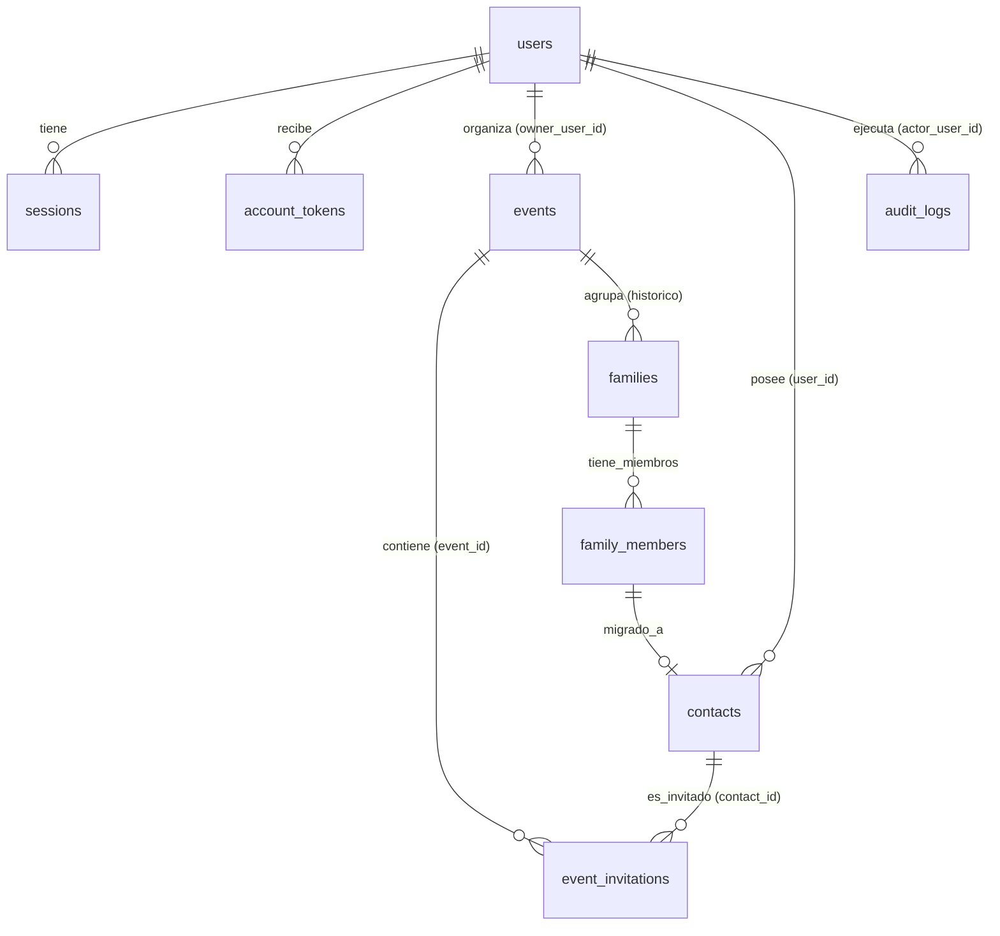

# Diccionario de Datos y Esquema — Tu Evento sin Dramas

> **Base de Datos:** `noodluis_TESD`  
> **Motor:** MySQL 5.7+ / MariaDB (InnoDB, `utf8mb4_unicode_ci`)  
> **Aislamiento Multi-inquilino:** El sistema particiona los datos mediante `users.id` vinculado a `events.owner_user_id` y `contacts.user_id`.  
> **Regla de Solo Lectura para K-2SO Track 3:** Solo generar consultas `SELECT` con `LIMIT 500`. Nunca inventar tablas no documentadas.

---

## 1. Diagrama Entidad-Relación Conceptual



---

## 2. Definición Detallada de Tablas

### 2.1 Tabla `users`
Cuentas de usuario registradas en la plataforma.
- `id` (BIGINT UNSIGNED, PK, AUTO_INCREMENT): Identificador único del usuario.
- `display_name` (VARCHAR(120), NOT NULL): Nombre visible del usuario.
- `email` (VARCHAR(254), NOT NULL, UNIQUE `uq_users_email`): Correo electrónico de acceso.
- `password_hash` (VARCHAR(255), NOT NULL): Hash bcrypt de la contraseña.
- `role` (ENUM('user', 'admin'), NOT NULL, DEFAULT 'user'): Nivel de privilegio del usuario.
- `status` (ENUM('pending', 'active', 'disabled'), NOT NULL, DEFAULT 'pending'): Estado de la cuenta.
- `email_verified_at` (DATETIME, NULL): Marca de tiempo de cuando confirmó su correo.
- `created_at` (TIMESTAMP, NOT NULL, DEFAULT CURRENT_TIMESTAMP).
- `updated_at` (TIMESTAMP, NOT NULL, ON UPDATE CURRENT_TIMESTAMP).

### 2.2 Tabla `sessions`
Sesiones activas de usuarios autenticados.
- `id` (BIGINT UNSIGNED, PK, AUTO_INCREMENT).
- `user_id` (BIGINT UNSIGNED, NOT NULL, FK -> `users.id` ON DELETE CASCADE).
- `token_hash` (CHAR(64), NOT NULL, UNIQUE): SHA-256 del token de cookie de sesión.
- `csrf_token_hash` (CHAR(64), NOT NULL): SHA-256 del token anti-CSRF emitido.
- `expires_at` (DATETIME, NOT NULL): Momento de caducidad de la sesión.
- `last_seen_at` (DATETIME, NOT NULL): Última actividad registrada.
- `created_at` (TIMESTAMP, NOT NULL).

### 2.3 Tabla `account_tokens`
Tokens temporales de un solo uso para flujos de verificación y recuperación.
- `id` (BIGINT UNSIGNED, PK, AUTO_INCREMENT).
- `user_id` (BIGINT UNSIGNED, NOT NULL, FK -> `users.id` ON DELETE CASCADE).
- `purpose` (ENUM('verify_email', 'reset_password'), NOT NULL).
- `token_hash` (CHAR(64), NOT NULL, UNIQUE): SHA-256 del token enviado en URL hash.
- `expires_at` (DATETIME, NOT NULL).
- `consumed_at` (DATETIME, NULL): Momento de uso del token (si no es NULL, ya fue consumido).
- `created_at` (TIMESTAMP, NOT NULL).

### 2.4 Tabla `auth_rate_limits`
Control de límites para mitigación de ataques de fuerza bruta.
- `identifier_hash` (CHAR(64), PK): Hash del identificador (IP o email).
- `window_started_at` (DATETIME, NOT NULL).
- `attempts` (SMALLINT UNSIGNED, NOT NULL, DEFAULT 0).
- `blocked_until` (DATETIME, NULL).

### 2.5 Tabla `events`
Eventos creados por los organizadores.
- `id` (BIGINT UNSIGNED, PK, AUTO_INCREMENT): Identificador del evento.
- `owner_user_id` (BIGINT UNSIGNED, NOT NULL, FK -> `users.id` ON DELETE CASCADE): Propietario del evento.
- `event_name` (VARCHAR(160), NOT NULL): Nombre descriptivo del evento.
- `event_date` (DATE, NULL): Fecha programada de la celebración.
- `created_at` (TIMESTAMP, NOT NULL).
- `updated_at` (TIMESTAMP, NOT NULL).

### 2.6 Tabla `contacts`
Libreta permanente y reutilizable de personas pertenecientes a cada usuario.
- `id` (BIGINT UNSIGNED, PK, AUTO_INCREMENT).
- `user_id` (BIGINT UNSIGNED, NOT NULL, FK -> `users.id` ON DELETE CASCADE): Dueño del contacto.
- `source_legacy_member_id` (BIGINT UNSIGNED, NULL, FK -> `family_members.id`): Enlace histórico si proviene de migración.
- `name` (VARCHAR(160), NOT NULL): Nombre completo del contacto.
- `email` (VARCHAR(254), NULL): Correo electrónico del contacto.
- `age` (TINYINT UNSIGNED, NULL): Edad aproximada.
- `type` (ENUM('adult', 'child'), NOT NULL, DEFAULT 'adult'): Categoría de asistente.
- `dietary_restrictions` (TEXT, NULL): Alergias, vegetarianismo, notas de menú.
- `notes` (TEXT, NULL): Preferencias y observaciones especiales.
- `created_at` (TIMESTAMP, NOT NULL).
- `updated_at` (TIMESTAMP, NOT NULL).

### 2.7 Tabla `event_invitations`
Invitaciones generadas para un evento y contacto específico con seguimiento RSVP.
- `id` (BIGINT UNSIGNED, PK, AUTO_INCREMENT).
- `event_id` (BIGINT UNSIGNED, NOT NULL, FK -> `events.id` ON DELETE CASCADE).
- `contact_id` (BIGINT UNSIGNED, NULL, FK -> `contacts.id` ON DELETE SET NULL).
- `legacy_family_id` (BIGINT UNSIGNED, NULL, FK -> `families.id` ON DELETE SET NULL).
- `guest_name` (VARCHAR(160), NOT NULL): Snapshot del nombre al momento de invitar.
- `guest_email` (VARCHAR(254), NULL): Snapshot del correo al momento de invitar.
- `status` (ENUM('pending', 'accepted', 'declined'), NOT NULL, DEFAULT 'pending'): Estado de respuesta.
- `response_token_hash` (CHAR(64), NULL, UNIQUE): Hash SHA-256 del token de enlace RSVP.
- `response_expires_at` (DATETIME, NULL): Expiración del enlace (por defecto 7 días post-evento o 90 días).
- `responded_at` (DATETIME, NULL): Momento en que el invitado confirmó o declinó.
- `revoked_at` (DATETIME, NULL): Momento de invalidación si el anfitrión revocó la invitación.
- `created_at` (TIMESTAMP, NOT NULL).
- `updated_at` (TIMESTAMP, NOT NULL).

### 2.8 Tablas Históricas: `families` y `family_members`
Conservadas para compatibilidad con la versión familiar previa a cuentas multi-usuario.
- `families`: `id`, `event_id`, `family_name`, `status` ('draft', 'confirmed'), `estimated_count`, `actual_count`, `semaphore_color` ('green', 'yellow', 'red').
- `family_members`: `id`, `family_id`, `name`, `age`, `type` ('adult', 'child'), `dietary_restrictions`, `notes`.

### 2.9 Tabla `audit_logs`
Bitácora de auditoría para operaciones ejecutadas por administradores o acciones críticas.
- `id` (BIGINT UNSIGNED, PK, AUTO_INCREMENT).
- `actor_user_id` (BIGINT UNSIGNED, NULL, FK -> `users.id`).
- `action` (VARCHAR(80), NOT NULL): Acción realizada (ej. `admin_access`, `user_status_change`).
- `target_type` (VARCHAR(40), NOT NULL).
- `target_id` (BIGINT UNSIGNED, NULL).
- `metadata` (TEXT, NULL): JSON o resumen de contexto.
- `ip_hash` (CHAR(64), NULL).
- `created_at` (TIMESTAMP, NOT NULL).

---

## 3. Consultas SQL Típicas para Reportes (DBA)

### Resumen de Asistencia por Evento
```sql
SELECT 
    e.id AS event_id,
    e.event_name,
    e.event_date,
    COUNT(i.id) AS total_invitaciones,
    SUM(CASE WHEN i.status = 'accepted' THEN 1 ELSE 0 END) AS confirmados,
    SUM(CASE WHEN i.status = 'declined' THEN 1 ELSE 0 END) AS declinados,
    SUM(CASE WHEN i.status = 'pending' THEN 1 ELSE 0 END) AS pendientes
FROM events e
LEFT JOIN event_invitations i ON i.event_id = e.id AND i.revoked_at IS NULL
WHERE e.owner_user_id = :user_id
GROUP BY e.id, e.event_name, e.event_date
ORDER BY e.event_date ASC;
```

### Lista de Invitados con Restricciones Alimentarias para Banquete
```sql
SELECT 
    i.guest_name,
    c.type,
    c.dietary_restrictions,
    c.notes
FROM event_invitations i
JOIN contacts c ON i.contact_id = c.id
WHERE i.event_id = :event_id
  AND i.status = 'accepted'
  AND (c.dietary_restrictions IS NOT NULL AND c.dietary_restrictions != '')
ORDER BY c.type, i.guest_name ASC;
```
